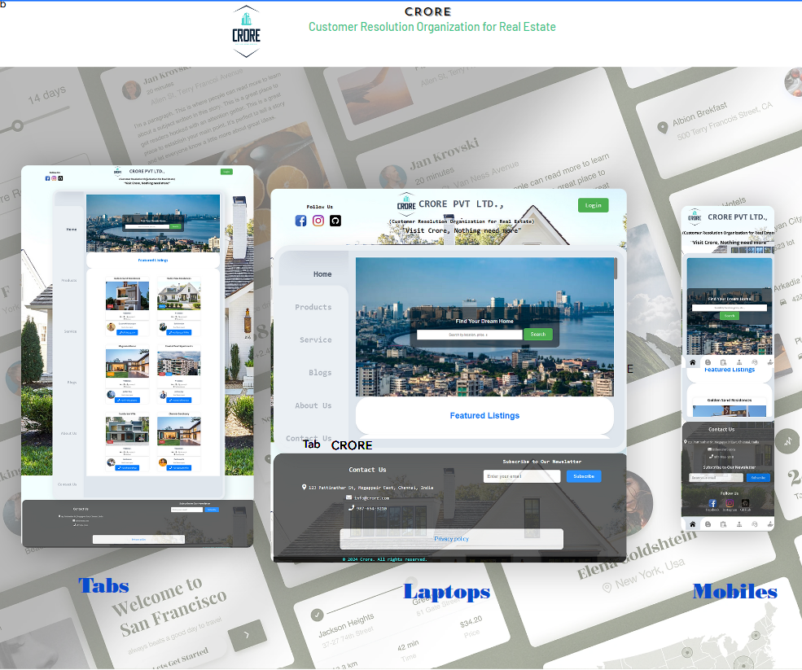
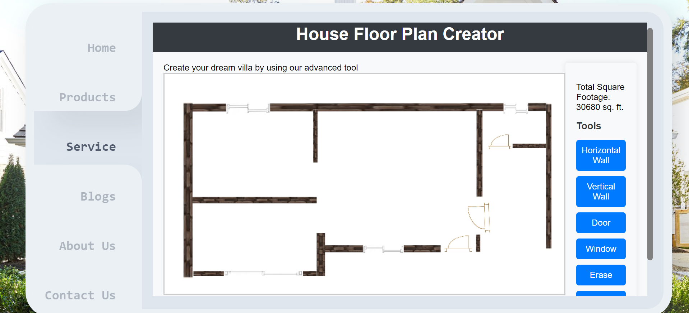

# Code_with_sakthi
<h1>Real Estate Project</h1>

<strong>Project Name:</strong> CRORE (Customer Resolution Organization for Real Estate )

<strong>Location:</strong> 10th block, JJ Nagar East, Mogappair, Chennai-37

<strong>Overview:</strong>

Crore is a real estate development located in Chennai. This exciting new project offers modern living spaces, state-of-the-art amenities, convenient location.

###Demo

<strong>Key Features:</strong>

<ul>
<li>Spacious floor plans.</li>
<li>Rooftop pool and fitness center.</li>
<li>Convenient public transportation options.</li>

</ul>

<strong>Amenities:</strong>

<ul>
<li>Community park.</li>
<li>On-site convenience store.</li>
<li>Dog park.</li>
</ul>

<strong>Contact Us:</strong>

For more information about CRORE, please contact us at info@crore.com.
<h2>General Information</h2>

<ul>
<li>CRORE is a state-of-the-art residential development located in Chennai. This exciting new project offers modern living spaces with sleek designs, high-quality finishes, and top-notch amenities. The complex features a range of floor plans, from cozy one-bedroom apartments to spacious three-bedroom units, all designed to provide the perfect blend of comfort and functionality. Residents can enjoy a range of amenities, including a rooftop pool, fitness center, and community park, as well as on-site convenience store and dog park. With its convenient location, CRORE is just a short walk from public transportation options, shopping centers, and other amenities. Whether you're looking for a relaxing retreat or an active lifestyle, CRORE has everything you need to make the most of your living space.</li>
</ul><ul>
<li>It solve the problem of communication between seller and buyer</li>
</ul><ul>
<li>This project will help to build strong communication between seller and buyer and real estate agent.</li>
</ul><h2>Technologies Used</h2>

<ul>
<li>HTML</li>
</ul><ul>
<li>CSS</li>
</ul><ul>
<li>JavaScript</li>
</ul><h2>Project Status</h2>

complete. But still having issues on design tool and login errors
<h2>Contact</h2>

